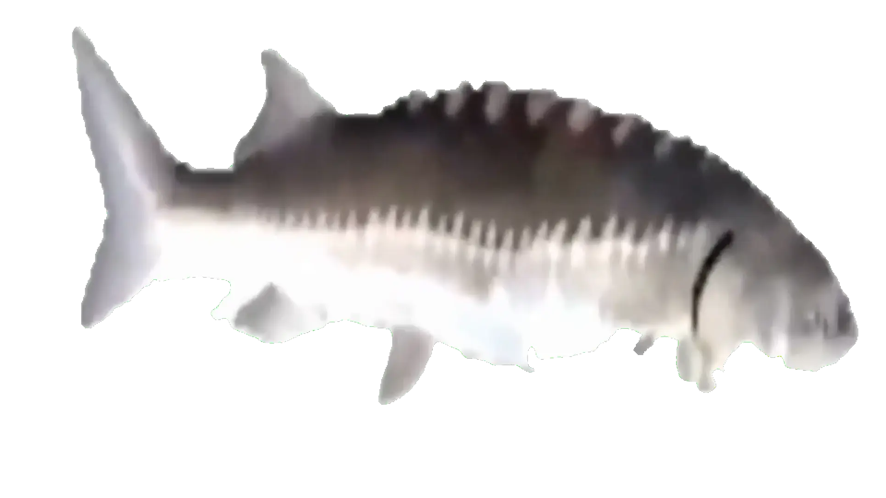

# Hello

#### 🌐 Check out my ✨blog✨ ---> 　　[<ins>fim.sh</ins>](https://fim.sh?source=github-readme) 
#### 📬 Contact me --->　　　　　　　　[<ins>hi@fim.sh</ins>](mailto:hi@fim.sh)

---

If you're looking for open-weight 🧠 LLM model for Bash, check out my benchmark --> [benshmark-v1](https://fim.sh/llm-benchmarks/benshmark/v1/?source=github-readme)

## Featured repos

